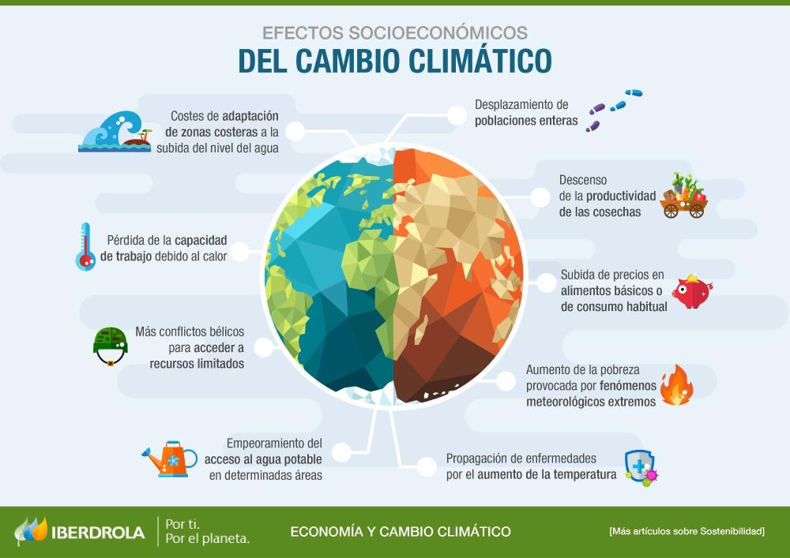
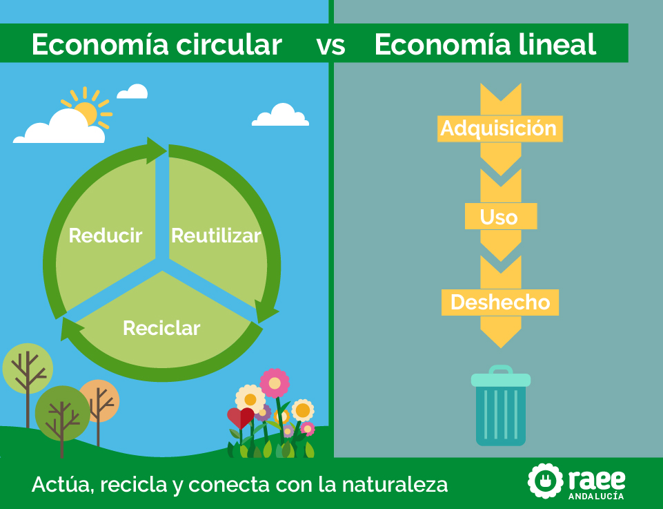
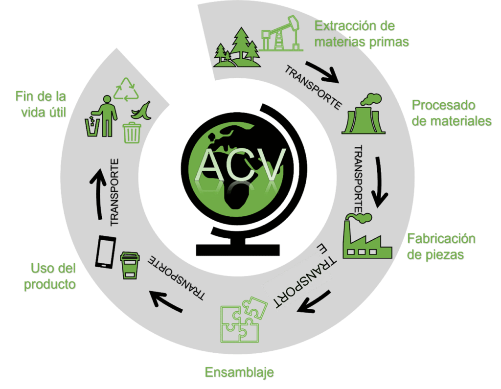

# DICIEMBRE 

### 12/12/2025 (fuera de plazo)
#### Nelson Gabriel Condori Argollo 2-DAM
# Semana 10 - Cambio Climático

### Resumen de la clase
En esta clase se habló del cambio climático y de cómo actúa como un multiplicador de amenazas. Se comentó que muchas actividades humanas influyen en este problema y que una de las principales causas es la emisión de CO₂.

### Preguntas
**¿Cuál es el principal emisor de CO₂?**  
La quema de productos fósiles.

**¿Qué puedo hacer yo como programador para mitigar el cambio climático?**  
Hacer el código más eficiente, reduciendo el consumo eléctrico.

### Reflexión personal
En mi opinión, el cambio climático es un problema importante que requiere la implicación de todos. Como programador, creo que optimizar el código y evitar procesos innecesarios puede ayudar a reducir el impacto ambiental, aunque sea en pequeña escala.

# NOVIEMBRE

### 05/12/2025
#### Nelson Gabriel Condori Argollo 2-DAM
# Semana 9 - Huella ecológica y huella de carbono

### Resumen de la clase
En esta clase vimos qué es la **huella ecológica** y la **huella de carbono**. La huella ecológica muestra si estamos usando más recursos de los que la Tierra puede regenerar. El profesor dijo que actualmente necesitaríamos “más de un planeta” para mantener nuestro ritmo de consumo.

La huella de carbono se centra en el CO₂ que emitimos. Aunque la naturaleza emite más CO₂ que nosotros, el problema es que **lo estamos aumentando muy rápido**, y eso genera el cambio climático.

También habló de que desde los años 50 la producción y el consumo se han disparado, y que podemos tomar decisiones para reducir el impacto, como ser más eficientes, usar menos recursos o incluso compensar emisiones plantando árboles (aunque a veces no funciona tan bien como parece).

### Ejemplos
- Plantaciones de árboles para compensar CO₂, pero muchas no sobreviven.  
- El modo oscuro o programas más eficientes para gastar menos energía.  
- La idea de que hoy gastaríamos como si tuviéramos **1,7 planetas**.

### Reflexión personal
Esta clase me hizo ver que la huella ecológica y la de carbono sirven para saber si vamos “bien o mal” con el uso de recursos. Me llamó la atención que no buscan precisión total, solo ayudarnos a comparar. También entendí que el problema no es solo cuánto emitimos, sino lo rápido que está cambiando todo. Creo que como futuros programadores podemos aportar un poco haciendo software más eficiente y siendo conscientes del consumo energético.

# NOVIEMBRE

### 28/11/2025
#### Nelson Gabriel Condori Argollo 2-DAM
# Semana 8 - Economía Lineal vs. Circular

### Resumen de la clase
Hoy hemos visto la diferencia entre la economía lineal y la economía circular. La economía lineal sigue el modelo tradicional: extraer, producir, usar, tirar. Es un flujo unidireccional de recursos y residuos
En cambio, la economía circular busca que los materiales vuelvan al sistema: reutilizar, reparar, rediseñar y reciclar.
También hablamos sobre cómo algunos residuos tienen un valor evidente (como el cobre o el hierro), mientras que otros no parecen valiosos pero igualmente generan problemas si no se gestionan (por ejemplo, emisiones, olores, envases o desechos orgánicos).  

### Ejemplos
- **Chatarra de coches:** tiene valor directo, por eso históricamente se ha reciclado siempre. El chatarrero la separa, la fundición la transforma, y parte del material vuelve a fabricar coches.
- **Espadas medievales:** cuando una espada se rompía, se fundía para recuperar el hierro. No era por sostenibilidad, sino porque el material tenía mucho valor.
- **Pescado en bandejas del mercadona:** muestra cómo muchas veces el consumidor NO puede elegir una opción más sostenible porque el sistema (la empresa) no lo ofrece.
- **Ferraris:** si un producto deja de fabricarse, aunque quieras no puedes comprarlo. eso muestra que muchas decisiones son colectivas, no individuales.

### Reflexión personal
La clase me hizo pensar en cómo muchas de nuestras decisiones diarias realmente están limitadas por lo que el mercado ofrece. No solo es responsabilidad del consumidor, sino también de empresas y gobiernos. Aun así, entiendo que es importante ser conscientes de nuestras elecciones, porque entre dos opciones, la más circular siempre será mejor para reducir residuos y usar menos recursos del planeta.

## Pregunta: ¿Y a mí que me cuentas? ¿Enfoque colectivo o individual?
Después de escuchar la explicación, creo que la circularidad necesita un **enfoque colectivo**. Las decisiones importantes "como los materiales de un coche, el diseño de un móvil, o cómo se envasa el pescado" no las toma el consumidor, sino las empresas y las políticas públicas. individualmente podemos elegir lo más sostenible disponible, pero si el sistema no ofrece alternativas, nuestras opciones son limitadas.

# NOVIEMBRE

### 14/11/2025
#### Nelson Gabriel Condori Argollo 2-DAM
# Semana 7 - Análisis del ciclo de vida

### Resumen de la clase
Vimos qué el ACV es una metodología para estudiar todo lo que necesita un producto desde que se extraen los materiales hasta que deja de usarse.
Repasamos que, a diferencia de otros seres vivos, los humanos fabricamos herramientas y productos, y cada uno de ellos requiere materiales, energía y procesos que vienen del planeta.
También analizamos cómo el ACV ayuda a comparar productos entre sí y a tomar decisiones más sostenibles.

### Ejemplos
- Un bolígrafo: de dónde salen los plásticos, metales y tintas, y cómo se procesan.
- El teléfono móvil: cuánto material se extrae, cómo se transforma en componentes y cuánta energía se consume.
- Diferencia entre ciclos naturales y ciclos industriales, que no se regeneran solos y requieren extracción constante.

### Reflexión personal
Me pareció interesante ver que incluso objetos pequeños necesitan enormes cantidades de materiales y procesos. No solemos pensar en ello, pero después de esta clase entiendo mejor por qué es importante reutilizar, reciclar y diseñar productos con menos impacto.
También creo que el ACV es una manera clara de visualizar si algo es sostenible o no.

## Actividad en clase: Análisis del Ciclo de Vida (ej. Móvil)

### 1. Extracción de materias primas
Se obtienen metales y minerales como litio, cobalto, oro, cobre y plástico.  
**Impactos:** contaminación del suelo y agua, alto consumo energético, explotación laboral y agotamiento de recursos.

### 2. Fabricación y ensamblaje
En fábricas se producen la pantalla, batería, procesador y carcasa.  
**Impactos:** es la etapa más contaminante; altas emisiones de CO₂, uso intensivo de energía, productos químicos y agua.

### 3. Transporte y distribución
El móvil se envía desde Asia a diferentes países usando barco, avión y camiones.  
**Impactos:** emisiones por transporte y uso de embalajes.

### 4. Uso del dispositivo
Incluye la carga del móvil y el funcionamiento de redes y servicios digitales.  
**Impactos:** bajo consumo eléctrico, desgaste de batería y uso indirecto de energía en servidores y redes.

### 5. Fin de vida (residuos electrónicos)
Cuando se desecha, se convierte en e-waste.  
**Impactos:** contiene sustancias tóxicas; si no se recicla correctamente, contamina suelo y agua.  
**Recuperable:** metales valiosos (oro, cobre), plásticos y baterías.

### Conclusión
La etapa más contaminante es la **fabricación**, seguida de la **extracción**.  
El uso genera impacto menor.  
Reciclar, reparar y alargar la vida del móvil son las acciones más sostenibles.

# OCTUBRE

### 31/10/2025
#### Nelson Gabriel Condori Argollo 2-DAM
# Semana 6 - La tierra es un sistema finito

### Resumen de la clase
Vimos que la Tierra es un sistema finito, que los recursos no son ilimitados y, si consumimos más de lo que se regenera, acabamos teniendo problemas. Repasamos la idea de capacidad de carga, el ciclo de materiales como el carbono y el agua, y el concepto de sostenibilidad aplicado a la vida real (ejemplo: acuíferos que se agotan si extraemos más agua de la que entra).

También hablamos de las tres dimensiones de la sostenibilidad: ambiental, social y económica, y cómo están conectadas.

### Ejemplos
- El agua subterránea en zonas agrícolas: si se extrae más de lo que entra, el nivel baja y cada vez cuesta más obtenerla.
- Ciclo del carbono: lo que forma parte de los seres vivos vuelve al entorno y se reutiliza.
- Relación entre recursos y economía: si falta agua para cultivos, cae la producción, afecta al trabajo y a la sociedad.

### Reflexión personal
Me quedó claro que sostenibilidad no es solo “cuidar el planeta”, sino entender que dependemos de recursos finitos y que si los agotamos, nuestra propia calidad de vida se veria afectada. La idea de las tres dimensiones me ayudó a ver que la sostenibilidad no es un tema solo ecológico, también afecta a la economía y a las personas.

# OCTUBRE

### 24/10/2025
#### Nelson Gabriel Condori Argollo 2-DAM
# Semana 5 - Estrategias de crecimiento r y k

### Resumen de la clase
Aprendimos sobre las estrategias de reproducción R y K que siguen los seres vivos. La R se basa en tener muchos descendientes y poca inversión en su cuidado (como los peces o insectos), mientras que la K implica tener pocos hijos, pero dedicarles más tiempo y protección (como los elefantes o los humanos).

#### ¿Que estrategias utilizamos los humanos?
 En la actualidad usamos principalmente la estrategia k pero con matices.
 ya que en la historia ciertas civilizaviones utilizaron ambas estrategias unas veces mas k y otras la r.

### Reflexión personal
Me pareció interesante pensar que incluso los seres humanos seguimos patrones parecidos a los de otras especies. Entendí que la vida busca mantenerse, y que la muerte y los cambios son necesarios para la evolución.

## OCTUBRE

### 17/10/2025
#### Nelson Gabriel Condori Argollo 2-DAM
# Semana 4 ¿vivimos solos?

### Resumen de la clase
Hablamos sobre cómo no vivimos solos, sino que compartimos el entorno con muchas especies y personas. Se explicó cómo nuestras acciones se cruzan con las de otros seres vivos y cómo eso influye en nuestro comportamiento y en el ecosistema.

### Ejemplos

Se comentaron distintos tipos de relaciones entre seres vivos (cooperación, competencia, mutualismo, parasitismo, depredación). También se habló del ejemplo de la trufa negra en Sarrión como una forma en que los humanos aprovechan relaciones naturales para generar beneficios.

#### ¿que hacemos nosotros: cooperamos o competimos?
Creo que como humanos hacemos ambas cosas. Competimos por recursos, oportunidades o ventajas, pero también cooperamos para lograr objetivos que solos no podríamos alcanzar. La cooperación nos permite avanzar más lejos.

### Reflexión personal
Me pareció interesante cómo muchas veces tenemos que adaptarnos a lo que nos rodea, incluso sin darnos cuenta. También me hizo pensar que, como humanos, a veces competimos, pero también cooperamos para lograr objetivos comunes.

## OCTUBRE

### 10/10/2025
#### Nelson Gabriel Condori Argollo 2-DAM
# Semana 3 Capacidad de carga

### Resumen de la clase
Hablamos sobre cómo las acciones humanas afectan el entorno y cómo la sostenibilidad busca evitar que destruyamos nuestras propias condiciones de vida.

### Ejemplos
Se mencionaron casos de cómo distintas especies transforman su entorno y cómo los humanos lo hacemos a gran escala.

Se planteó la pregunta:
#### ¿hay un limite para la poblacion humana?
entendí que sí existen límites, aunque podemos retrasarlos con tecnología y organización.
Si seguimos creciendo sin control, podríamos llegar a un punto en que los recursos no alcancen para todos.

### Reflexión personal
Me hizo pensar que no se trata de salvar el planeta, sino de asegurarnos de poder seguir viviendo en él y aprender a vivir dentro de esos límites.

## SEPTIEMBRE

### 03/10/2025
#### Nelson Gabriel Condori Argollo 2-DAM
# Semana 2 ¿acabaremos con la vida de nuestro planeta?

hay varias formas en que la vida en nuestro planeta pueda acabarse:
- una guerra de bombas nucleares, que ocacione una catastrofe en el planeta y acabe con toda la vida eventualmente.
- una contaminnacion global masiva y que mate poco a poco a la naturaleza a todos los seres vivos.
- enfermedades biologicas creadas por el humano que acaben con la vida de todo ser vivo.

estos factores serian provocados por los humanos.

~~un factor externo seria que caiga un meterorito que acabaria con toda la vida en el planeta~~

### 26/09/2025

#### Nelson Gabriel Condori Argollo 2-DAM
# Semana 1 - Introducción a la Sostenibilidad

## Qué entendí por sostenibilidad
La sostenibilidad es la capacidad de mantener un sistema en el tiempo, asegurando que se satisfacen las necesidades actuales sin comprometer las de las generaciones futuras. No es solo “equilibrio”, sino integrar lo ambiental, social y económico.

## Ejemplos que vi en clase
- Uso responsable de los recursos (agua, energía).

## Reflexión personal
Como futuro desarrollador, puedo aplicar la sostenibilidad en:
- Escribir código limpio y eficiente.
- Usar servicios en la nube que apuesten por energías renovables.
- Crear aplicaciones que tengan impacto social positivo.

